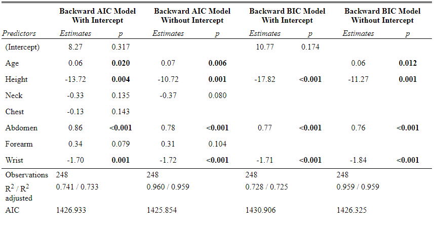
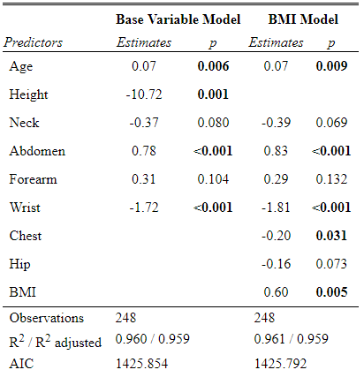
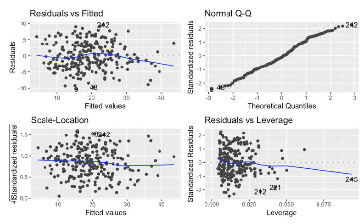
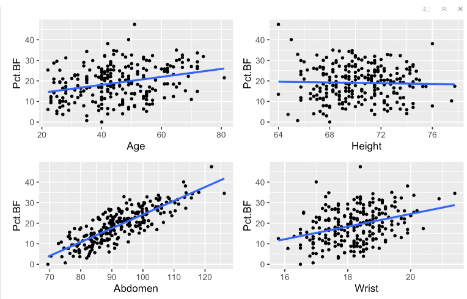

## Introduction

Obesity has become an increasingly important global health problem
(Jaacks et al., 2019). It is defined as the accumulation of excess fat
in the body, to the extent of impacting an individual's health and
well-being (Deurenberg & Yap, 1999). Body fat percentage is a
measurement that can help define individuals into a weight category,
such as obese (Trung et al., 2019). Furthermore, body fat percentage can
be used as a heath and fitness indicator. However, measuring body fat
percentage is costly and difficult to accurately measure (Deurenberg et
al., 2002). Hence, the aim of our analysis is to create a model that
estimates a male's body fat percentage from easily accessible
measurements.

## Data Set

Our data set contains the measurements of 250 men of various ages
(Bodyfat DASL, 2022). The body fat percentage of each male was
estimated from their body density. The data set also includes the men's
age, height, weight, and various body measurements. In total there are
15 measurements, all classified as continuous, apart from age which is
discrete. For data cleaning, we removed the density variable and two
observations with less than one per cent body fat. In terms of data
wrangling we converted the units for height and weight into the metric
system and calculated BMI for the remaining 248 observations.

## Model selection

For our model selection process we considered both backwards and
forwards stepwise selection. We decided to go with the backwards
process, as our research indicated backwards models were generally
better equipped to deal with collinearity. Because a backwards process
considers the full set of variables initially, it is more likely to keep
a set of collinear variables whereas a forwards model is more likely to
not include any of the correlated variables. Because our data set
included a range of physical measurements which are all correlated to
some extent, we felt we therefore needed to use a backwards stepwise
selection process.

Noting the high p value of the intercept in our models, we generated
models without intercepts and found the adjusted R squared values of
those models to be significantly higher (see figure 1). We therefore
decided to remove the intercepts from all future models.

BMI is often used as an indicator of healthy weight adjusted for height,
we calculated BMI for the sample and generated a model which used BMI as
a composite for height and weight. The fit of both models was very
comparable (see figure 2), with nearly identical adjusted R squared and
AIC values. We decided to move forward with the original variable
specification because the BMI model used more variables overall. Given
that the models had very similar fit we chose the simpler model both for
the practical applicability of the model and because we believed the BMI
model would perform worse in out of sample testing due to possible
over-fitting.

The two standard criterion for automated model selection are AIC and BIC
(Bayesian Information Criterion). We decided to examine models using
both criterion (see figure 3). The models had identical adjusted R
squared, with the BIC model using two fewer variables. We decided to
examine both models using out of sample performance evaluation methods.

## Performance: 

To evaluate the performance of our AIC and BIC models we used 10 fold
cross validation

## Assumption Checking

-   **Linearity:** By looking at the plot of the residuals against the
    fitted values (Figure \4), we can see a fairly horizontal line to 0 however it's
    a little worrying near the end portion on the line where it seems to
    develop a sort of declining pattern. This inspired a further look
    into the assumption through looking at each predictor variable
    plotted against body fat percentage individually (Figure \5) which
    seems to demonstrate linearity as points above and below the line
    are fairly equal in proportion.
-   **Independence:** Independence can't really be tested through the data,
    we just placed trust in the fact that the data was collected
    independently of each other allowing errors to be independent. This
    assumption should be satisfied at the data comes from the Brigham
    Young University which is a fairly trusted source, they state the
    data comes from 250 men at varying ages hopefully indicating
    independence.
-   **Normality:** In the normality assumption we are assuming the residual
    error is normally distributed. Judging from the qq-plot generated
    from the residuals (Figure \4), it seems to follow the line fairly
    well up until the end portion, which again was a little worrying.
    However even if qq-plot doesn't demonstrate normality we should be
    able to argue the Central Limit Theorem allowing for this assumption
    due to the large number of observations.
-   **Homoscedasticity:** Through plotting the standardized residuals and
    fitted values (Figure \4) we should be able to test for homoscedasticity where
    residuals are assumed to have a constant variance. In order to have
    this assumption the points should be equally spread above and below
    the line as well as having a line horizontal (or void of any
    patterns). The graph shows equally spread points and the line isn't
    horizontal though it seems void of patterns enough to be able to
    assume homoscedasticity.

## Results

Our final model is obtained from a backward stepwise linear regression
model with BIC as selection criteria. This is the best fit among all our
models with only 4 predictors.

## Discussion

-   Effectiveness Model: Body_Fat_Percentage = 0.05795 \* Age - 11.27374
    \* Height + 0.76046 \* Abdomen - 1.84242 \* Wrist Our model has a
    total of four variables, each of which has a p-value less than 0.05.
    This represents a significant effect of each of the variables on the
    model.Our adjusted R square value is 0.9586.This represents that our
    model has a high predictive accuracy. Our model can be used by back
    health organizations to measure the healthiness of people's body fat
    percentage.

-   Limitation 1.We used only physical data as a reference. This leads
    to a large error when dealing with special populations. For example,
    fit elderly people, people who are short in height but work out
    regularly and people of different races.. Future study to overcome
    limitations:We consider increasing the number of elements including
    daily calorie intake, time spent in daily exercise, etc. to reduce
    the effect of single body data on body fat percentage.

## Conclusion

TBC

## Appendix

Figure 1 (Testing the intercept):

 Figure 2 (BMI Specification):

Figure 3 (AIC vs BIC):

Figure 4 (Assumptions Graphs)

Figure 5 (Linearity further explored)

## References:

Bodyfat Data and Story Library (DASL). (2022). https://dasl.datadescription.com/datafile/bodyfat/ 

Deurenberg, P., & Yap, M. (1999). The assessment of obesity: methods for measuring body fat and global prevalence of obesity. Best practice & research clinical endocrinology & metabolism, 13(1), 1-11. https://doi.org/10.1053/beem.1999.0003

Deurenberg, P., Yap, M., & Guricci, S. (2002). Asians are different from Caucasians and from each other in their body mass index/body fat per cent relationship. Obesity reviews, 3(3), 141-146.
https://doi.org/10.1046/j.1467-789X.2002.00065.x

Jaacks, L. M., Vandevijvere, S., Pan, A., McGowan, C. J., Wallace, C., Imamura, F., Mozaffarian D., Swinburn, B & Ezzati, M. (2019). The obesity transition: stages of the global epidemic. The Lancet Diabetes & Endocrinology, 7(3), 231-240. https://doi.org/10.1016/S2213-8587(19)30026-9

Trung, N. N., Chu, D. T., & Hanh, N. T. H. (2019). Percentage body fat is as a good indicator for determining adolescents who are overweight or obese: a cross-sectional study in Vietnam. Osong public health and research perspectives, 10(2), 108. DOI: 10.24171/j.phrp.2019.10.2.10
