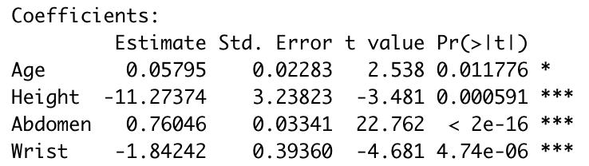
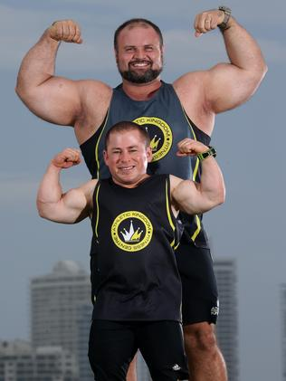

```{r setup, include=FALSE}
knitr::opts_chunk$set(echo = FALSE)
library(tidyverse)
library(dplyr)
library(DT)
library(sjPlot)
library(broom)
library(caret)
library(jtools)
library(gridExtra)
library(ggfortify)

data <- read.delim("bodyfat.txt")

# arrange data in ascending order 
data_order <- data %>% 
 arrange(Pct.BF) 

# override weight and height columns in pounds and inches to kilograms and meters, categorise ages, create BMI variable
data1 <- data_order %>% 
  mutate(Height = (Height/39.37)) %>%
  mutate(Weight = (Weight/2.205)) %>%
  mutate(BMI = (Weight/(Height)^2))

# only keep percentage body fat values greater than 3% (remove two points)
df <- subset(data1, Pct.BF>=3)

# remove density
df <- df[ , !names(df) %in% c("Density")] ## works as expected

df2 <- df[ , !names(df) %in% c("Weight")]

df2 <- df2[ , !names(df2) %in% c("Height")]
df3 <- df[ , !names(df) %in% c("BMI")] ## works as expected


# intercept-only model
intercept_only <- lm(Pct.BF ~ 1, data = df)

# model with all predictors
model_intercept <- lm(Pct.BF ~ ., data = df3) #Added intercept back in

#no intercept model

model_nointercept <- lm(Pct.BF ~ .-1, data = df3)

# backward stepwise regression 1
backward_intercept_aic <- step(model_intercept, direction = 'backward', scope = formula(model_intercept), trace = FALSE)

backward_nointercept_aic <- step(model_nointercept, direction = 'backward', scope = formula(model_nointercept), trace = FALSE)

model_bmi_intercept <- lm(Pct.BF ~ ., data = df2)

model_bmi_nointercept <- lm(Pct.BF ~ .-1, data = df2)

backward_bmi_intercept <- step(model_bmi_intercept, direction = 'backward', scope = formula(model_bmi_intercept), trace = FALSE)

backward_bmi_nointercept <- step(model_bmi_nointercept, direction = 'backward', scope = formula(model_bmi_nointercept), trace = FALSE)

model_nointercept <- lm(Pct.BF ~ .-1, data = df3)


backward_nointercept_aic <- step(model_nointercept, direction = 'backward', scope = formula(model_nointercept), trace = FALSE)

summary(backward_nointercept_aic)


backward_nointercept_bic <- step(model_nointercept, direction = 'backward', scope = formula(model_nointercept), trace = FALSE, k=log(248))

summary(backward_nointercept_bic)

backward_intercept_bic <- step(model_intercept, direction = 'backward', scope = formula(model_nointercept), trace = FALSE, k=log(248))

summary(backward_nointercept_bic)
```


## Summary

- Percent body fat, although an accurate health indicator, is difficult and costly to measure
- Aim: create a model to accurately estimate a male’s percentage body fat from easily made body measurements
- Final model characteristics: 
   - Backwards stepwise selection
   - BIC
   - No intercept 

Percent Body Fat = 

0.05795 * Age - 11.27374 * Height + 0.76046 * Abdomen - 1.84242 * Wrist


## Introduction (problem overview)

- Obesity has become an increasingly important global health problem
- Percent body fat (PBF) is an accurate indicator of weight category (e.g., obese) 
- PBF is difficult, timely and expensive to measure


Aim: create a model that can predict a male's PBF from more easily accessible measurements


# Dataset description 

- Data set includes 15 body measurements of 250 males 
- All classified as continuous apart from age (discrete)
- Measurements are potentially useful to estimate percent body fat 


Source: BYU Human Performance Research Center <http://www.byu.edu/chhp/intro.html>

## Data Tidying

1. Converted variables to metric units
2. Removed density variable - measured to directly calculate body fat percentage
3. Removed two observations with <1% body fat
4. BMI for each male was calculated and added  

```{r, echo = FALSE}
df_round <- round(df2, 2)
datatable(select(df_round,c(1:6, 14)), options = list(pageLength = 6))
```

# Cleaned Data and Model Selection Foundation

Number of Observations: 248

Model response variable: percent body fat  

Model potential predictor variables: 14 remaining variables 


## Model Selection (Summary) 
- Forward vs Backward Stepwise Selection
- Intercept Testing
- BMI
- AIC vs BIC


## Backwards vs Forwards AIC

```{r, echo=FALSE, message=FALSE, warning=FALSE}
# intercept-only model
intercept_only <- lm(Pct.BF ~ 1, data = df3)

# model with all predictors
model <- lm(Pct.BF ~ ., data = df3) #Added intercept back in

# backward stepwise regression
backward <- step(model, direction = 'backward', scope = formula(model), trace = FALSE)

# forward stepwise regression
forward <- step(intercept_only, direction = 'forward', scope = formula(model), trace = 0)

tab_model(backward, forward, show.ci = FALSE, show.aic = TRUE, dv.labels = c("Backward Model", "Forward Model"))

```


## Testing the Intercept
```{r, echo=FALSE, results='hide', message=FALSE, warning=FALSE}

tab_model(backward_intercept_aic, backward_nointercept_aic, show.ci = FALSE, show.aic = TRUE, dv.labels = c("Backward Model", "Forward Model"))

tab_model(backward_intercept_bic, backward_nointercept_bic, show.ci = FALSE, show.aic = TRUE, dv.labels = c("Backward Model", "Forward Model"))
```

## BMI with intercept
```{r, echo=FALSE, results='hide', message=FALSE, warning=FALSE}
summary(backward_bmi_intercept)
```


## BMI without intercpet
```{r, echo=FALSE, results='hide', message=FALSE, warning=FALSE}
summary(backward_bmi_nointercept)
```

- with BMI vs without BMI

## Include BMI
```{r, echo=FALSE, results='hide', message=FALSE, warning=FALSE}
summary(backward_bmi_intercept)
```

## Include BMI

```{r, echo=FALSE, results='hide', message=FALSE, warning=FALSE}
summary(backward_bmi_nointercept)
```

## AIC
```{r, echo=FALSE, results='hide', message=FALSE, warning=FALSE}
summary(backward_nointercept_aic)
```

## BIC 
```{r, echo=FALSE, results='hide', message=FALSE, warning=FALSE}
summary(backward_nointercept_bic)
```


# Performance and results

## 10 fold cross validation between AIC and BIC
```{r echo=FALSE, message=FALSE, warning=FALSE,fig.width=10,fig.height=3}
set.seed(1)
cv_full_aic = train(
  Pct.BF ~ Age + Height + Neck + Abdomen + Forearm + 
    Wrist - 1, df3,
  method = "lm",
  trControl = trainControl(
    method = "cv", number = 10,
    verboseIter = FALSE
  )
)

cv_full_bic = train(
  Pct.BF ~ Age + Height + Abdomen + Wrist - 1, df3,
  method = "lm",
  trControl = trainControl(
    method = "cv", number = 10,
    verboseIter = FALSE
  )
)


results <- resamples(list(AIC = cv_full_aic,  BIC = cv_full_bic))

# put into a dataframe
mae = c(results$values$`AIC~MAE`,results$values$`BIC~MAE`)
rmse = c(results$values$`AIC~RMSE`,results$values$`BIC~RMSE`)

combine = data.frame(mae,rmse)
combine = combine%>% mutate(type = c(rep("AIC",10),rep("BIC",10)))
colnames(combine) <- c('MAE','RMSE','type')

# draw the plot
p1 = plotly::ggplotly(ggplot(combine,aes(x = type,y=MAE,color=type)) +geom_boxplot()+
  labs(y = "MAE")+theme_light()+theme(axis.title.y = element_blank())+coord_flip())

p2 = plotly::ggplotly(ggplot(combine,aes(x = type,y=RMSE,color=type)) +geom_boxplot()+
  labs(y = "RMSE")+theme_light()+theme(axis.title.y = element_blank())+coord_flip())

Method = c("AIC","BIC")
RMSE = c(cv_full_aic$results$RMSE,cv_full_bic$results$RMSE)
MAE  = c(cv_full_aic$results$MAE,cv_full_bic$results$MAE)
knitr::kable(data.frame(Method, RMSE,MAE))

manipulateWidget::combineWidgets(p1, p2, nrow = 1)

```

## Result

Our final model is **backward BIC model** with **no intercept**.

```{r }
backward_nointercept_bic$coefficients
summary(backward_nointercept_bic)
```


# Assumptions

## Initial look
```{r}
autoplot(backward_nointercept_bic)
```


## Linearity

- Predictors and outcome assumed to have a linear relationship
- Horizontal line should show no distinct patterns, however it shows some distinct patterns

```{r echo=FALSE, fig.height=6, fig.width=15, message=FALSE, warning=FALSE, results='hide'}
autoplot(backward_nointercept_bic, 1)
```

## Looking further into Linearity

- Looking further through visualizing each predictor against Body Fat shows points fairly equal above and below the line

```{r message=FALSE, warning=FALSE}
l1 <- data %>% ggplot() + aes(x = Age, y = Pct.BF) + geom_point(size = 1) + geom_smooth(method = "lm", se = FALSE)
l2 <- data %>% ggplot() + aes(x = Height, y = Pct.BF) + geom_point(size = 1) + geom_smooth(method = "lm", se = FALSE)
l3 <- data %>% ggplot() + aes(x = Abdomen, y = Pct.BF) + geom_point(size = 1) + geom_smooth(method = "lm", se = FALSE)
l4 <- data %>% ggplot() + aes(x = Wrist, y = Pct.BF) + geom_point(size = 1) + geom_smooth(method = "lm", se = FALSE)
grid.arrange(l1,l2,l3,l4, ncol = 2)
```


## Independence

- We are assuming data was collected in an independent manner, or errors are independent
- Data collected from Brigham Young University, fairly trusted source
- Stated 250 different men of varying ages, hopefully indicating they are all independent of each other


## Normality

- Residual error assumed to be normally distributed
- Points on QQ plot are fairly close to the line up until the ends, which may be of concern
- However due to large number of observations its possible Central Limit Theorem solves this assumption

```{r,fig.width=15,fig.height=6}
autoplot(backward_nointercept_bic, 2)
```

## Homoscedasticity

- Residuals assumed to have constant variance
- Points seem equally spread above and below the line
- Line possibly not horizontal enough, however it doesn't seem of too much concern

```{r,fig.width=15,fig.height=6}
autoplot(backward_nointercept_bic, 3)

```


# Discussion and conclusion

## Effectiveness
Body_Fat_Percentage = 0.05795 * Age - 11.27374 * Height + 0.76046 * Abdomen - 1.84242 * Wrist

 - Number of variables: 4

 - P-Value: 

```{r} 
  
```

 - Adjusted R-squared value: 0.9586

## Limitations and future study

The consideration of physical factors alone is limiting.

 - Older people
 

```{r, fig.show = "hold", out.width = "50%", fig.align = "default"}
 

```


 - Shorter people


 - People who work out regularly
 
```{r, fig.show = "hold", out.width = "50%", fig.align = "default"}
 
```


### Future study to overcome limitations:

 - Diet structure

 - Daily exercise time


## References 


