```{r setup, include=FALSE}
knitr::opts_chunk$set(echo = TRUE, message = FALSE, warning = FALSE, cache = TRUE)
```

```{r}
library(kableExtra)
library(knitr)
library(dplyr)
library(caret)
library(e1071)
library(class)
library(xgboost)
library(nnet)
library(tidyverse)
library(janitor)
library(sf)
library(ggplot2)
library(randomForest)
library(plotly)
library(forecast)
library(iml)
library(glmnet)
library(Metrics)
```

```{r}
## Prepare
merged_effort <- read.csv("merged.csv")
split_indices <- createDataPartition(merged_effort$average_bleaching, p = 0.8, list = FALSE)
training_set <- merged_effort[split_indices, ]
testing_set <- merged_effort[-split_indices, ]
training_set$bleaching_occurred <- as.factor(ifelse(training_set$average_bleaching > 0, 1, 0))
testing_set$bleaching_occurred <- as.factor(ifelse(testing_set$average_bleaching > 0, 1, 0))
```


## Executive Summary

Indonesia’s status as an archipelago and its expansive coral reef systems have heavily shaped the fishing industry due to their high catch rates, economic value and extensive international trade (Williams et al., 2019; MMAF, 2011). As a result, Indonesia is one of the world's most fish-dependent nations, producing approximately 12 million tonnes annually (Halim & Juanri, 2016). 

However, due to well documented impacts from anthropogenic climate change as well as the less widely understood relationships with industrial fishing, coral reef health is in decline, placing the Indonesian fishing industry at risk. 

Through a thorough analysis, it is evident that ocean warming coupled with cyanide fishing is causing exacerbated bleaching events. Additionally, overexploitation of key fish species such as skipjack tuna not only strains fishing yields but also heightens reef vulnerability to climate stressors. 

In addition to our analysis, we developed an application through which the Indonesian government can make predictions involving the chances of bleaching based on select variables. Paired with the application, we fine tuned a Large Language Model through which Indonesian marine researchers can interact with our report, results, and the latest data. This ensures that all insight derived from our investigation can be served to our audience.

We believe our analysis, and delivered tools, will be used to make meaningful decisions regarding industrial fishing thresholds, as well as other measures, to ensure Indonesia protects its reef health.


## Background

Indonesia is the world’s largest archipelago and encompasses a substantial portion of the reefs in the Coral Triangle. It also hosts 590 species of scleractinian corals and 2500 species of fish (Gusviga et al., 2021; Powderham & van der Meij, 2020). 

However, the future of coral reefs in Indonesia is under substantial threat due to the impacts of climate change primarily caused by anthropogenic activity (Alvarez-Filip et al., 2009; Pandolfi et al., 2011). Global warming causes sea surface temperatures to rise, putting corals under stress and causing them to bleach via the expulsion of their endosymbiotic algae, zooxanthellae (Brown, 1997). Bleaching exacerbates the vulnerability of coral reefs and pushes them towards a state of decline with severe ecological and economic consequences (Brown, 1997). 

Besides the environmental impacts, this is doubly worrying for Indonesia. Firstly, industrial fishing is a vital component of Indonesia’s economy, supporting the livelihoods of millions of individuals (REF). Secondly, Indonesia’s population heavily relies on fish, with an average per capita consumption of over 40 kilograms of fish annually (Statista, 2023). 

This research focuses on assessing the impact of industrial fishing on coral reef health by monitoring bleaching rates. Numerous variables such as sea surface temperature anomaly (SSTA), fishing proximity to the reef, and fish species type are examined to understand their influence on this relationship. Machine learning models are used to explore the relationship between these variables with an aim to assist the Indonesian government with effective tools. Overall, this research will enable thoughtful policy making and ensure the long-term sustainability of Indonesia’s marine resources.


## Methods

### Data Collection and management

In order to comprehensively investigate our research question, we had to begin with the collection of appropriate data. These are the sources we used.

- Reef Check Bleaching data. This dataset provides information related to coral bleaching and was sourced from github. 

- The Institute for Marine and Antarctic Studies (IMAS) Fishery Data. This dataset provides information relating to industry fisheries. It’s open Australian government data. Although industrial fishing variable we have implemented in our model is not a direct causation of the bleaching, we are inferring a correlative effect based on the growing demand of fish stock needed in Indonesia, and harmful fishing practices such as cyanide fishing which have continued to be used to keep up with stock demands.

- Fishing Effort Data from Sea Around Us (SAU). This enabled us to stratify based on industrial fishing in Indonesia. This dataset was used to explore the influence of the Indonesian government in the fishing sector. 

We proceeded with joining the data based on variables such as location, year, and the gear used. In order to reduce the size of the dataset, we also filtered down to Indonesia. Additionally, we aggregated results across different types of fishing gear used. A potentially limitation may be that through the process of aggregating the data we lost some data that may have had an outsized impact on the model. 

We followed this up with some exploratory data analysis (EDA) where we plotted some initial graphs to see if we could identify any interesting results from a marine science perspective. As well as to see if there were any immediate issues with the data and how we joined it all.

### Model Development

After completing a satisfactory EDA, we decided to proceed with developing some models that would help us investigate our research question.

In order to analyze the impact of industrial fishing on coral health, we pursued the development of a reef health prediction model. It focused on the following key variables.

- Sea Surface Temperature Anomaly (SSTA). The difference between the sea surface temperature (SST) and the long-term average SST of the Coral Triangle for a specific time period. A positive SSTA highlights warmer conditions than the long-term average. This positive temperature anomaly increases the vulnerability of coral reefs to various stressors. 

- Fishing Effort. Effort is measured through the number of fishing vessels, fishing gear, and rate of fish caught.

- Fishing to Reef Distance. Fishing activity conducted closer to reef ecosystems poses a larger risk of declined reef health due to pollution and overfishing rates. 

- Average Coral Bleaching Rate. We will use coral bleaching rate as a proxy for reef health.

In order to arrive at our conclusion to proceed with these variables we considered what we were trying to investigate and supported this by using linear regression and AIC to understand the impact of different variables.

We considered the use of a few different models to find the most appropriate one.

- Linear Regression. Easy to understand size and direction of variable impact, which may be good for marine science researchers without a technical background. However, this does assume a linear relationship. 

- Logistic Regression. This would be well suited for if we want to classify reef health in a binary manner such as ‘negative impact’ or ‘no impact’. It does, though, assume linear relationships.

- Random Forest. While this does have potential to be overfit, it could be a great option as it’s suited for non linear relationships.

- Support Vector Machine. While this model has poor interpretability, it may be great for helping us identify non linear relationships. It can also be well suited for complex boundaries that may be present in the marine science domain.

- K Nearest Neighbor. This is a relatively easy model to understand, which will be a benefit for ensuring marine scientists can understand it. A disadvantage would be that it can get expensive, computationally, when dealing with lots of data. This would be felt if the marine researchers try to incorporate new data sets.

- Neural Network. We built a single layer feed forward network. We find it may be good at identifying relationships that are non linear. If we decide to scale the dataset it will also be significantly less computationally expensive than, for example, KNN. However, it won't be that interpretable, which will be a disadvantage for the Indonesian marine researchers.

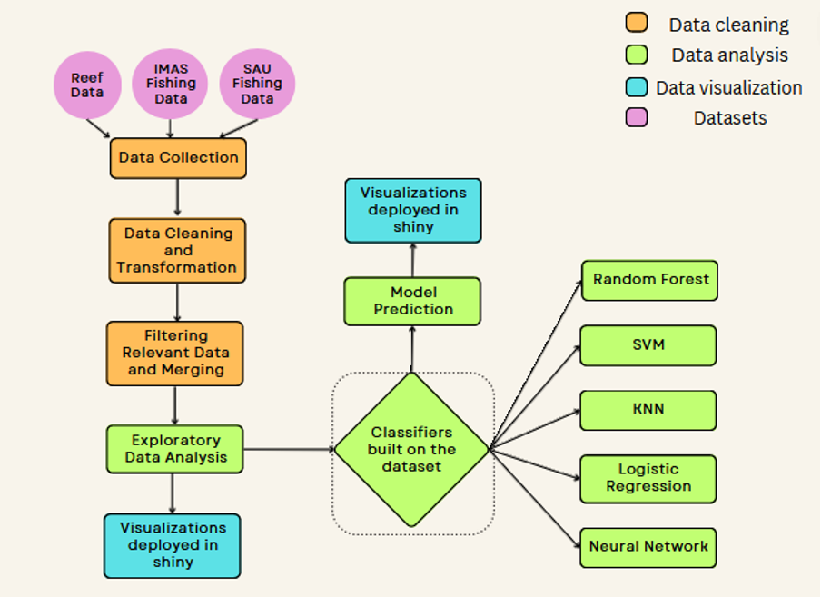

### Evaluation Strategies 
In order to ensure a thorough evaluation, we decided to approach this from a few different angles.
Quantitative Evaluation
For our quantitative evaluation, we decided to investigate a number of useful metrics, beyond just accuracy.

**Evaluating Accuracy**

In order to evaluate model accuracy, we would proceed with a 80/20 train test split and the use of cross validation. This would enable us to get a good sense of model performance. 

This will enable marine scientists to remain confident with future projections of reef health made through our models. 

**Evaluating Stability**

To evaluate the model stability, we performed repeated 10 fold cross validation 5 times and then compared the variance of the results. This would help elucidate model robustness and consistency. 

By ensuring our models are highly stable, marine scientists will be able to rest assured that values obtained from our models are highly consistent and not freak values.

**Evaluating Scalability**

In order to understand how the training dataset size impacts model performance, we will be assessing scalability. This will be done through the development of a learning curve. This will enable us to see the relationship between size of training data and model performance. 

By ensuring effective scalability, as marine scientists collect more relevant future data and want to include it in the model, they can understand the impact it will or will not have on the models.

**Evaluating Interpretability**

We will be evaluating the interpretability of our model through the use of a Shapely plot. This will help allocate a value to the variables used to make predictions. The higher the value the greater the contribution is to the prediction. This in turn will help provide insight into the key features and improve model transparency. 

Due to some marine scientists likely not having a technical background, ensuring our models are highly interpretable will be key to enabling all relevant stakeholders to understand models and act on them.

**Qualitative Evaluation**

In order to gauge a sense of users' subjective perceptions of the system, we decided to conduct some user research through a survey. In order to gain relevant insight, we sent this to marine science students.

Full question list, explanation, and breakdown is available in Appendix 4.

**Usability Evaluation**

We additionally believed it would be valuable to conduct an evaluation of the shiny application  user experience. This would also be sent out to marine science students. 

Full question list, explanation, and breakdown is available in Appendix 4.

It is worth noting we are using marine students as a proxy for our end audience, Indonesian marine science researchers. This is because we can access their perspective relatively easily, as well as the fact they likely have similar technical knowledge.

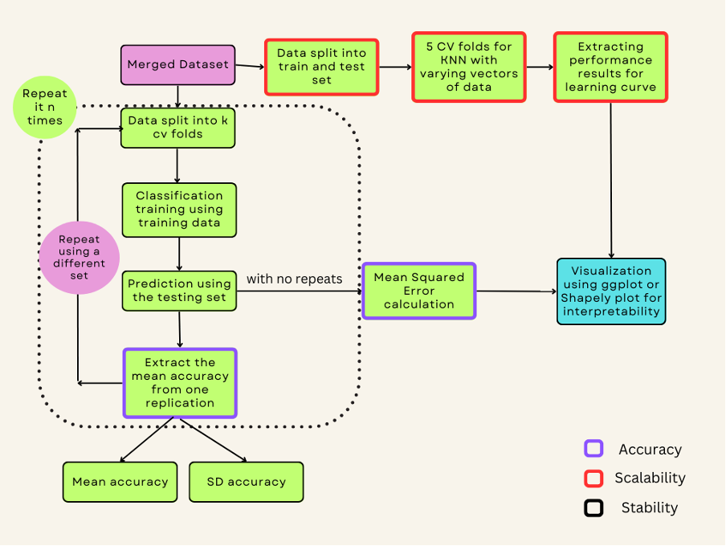

### Qualitative Evaluation Results

Refer to Appendix 4 for detailed information into responses.

General feedback of the Random Forest model was positive. Initial reactions to the model had overwhelmingly positive sentiment. The perceived model strength was the accuracy while weaknesses listed focused on a lack of clarity and instruction. Because of this, survey respondents recommended we add detail and supporting information. 

### Usability Evaluation Results

Refer to Appendix 4 for detailed information into responses.

Our initial shiny application usability feedback was encouragingly positive. While learnability, ease of use, and speed were ranked highly, there were some bugs listed. Additionally, our rankings for how user friendly the system was could have been better. Because of this, we had recommendations revolving around improving the amount of explanatory text we provide.

### Deployment Process Based on Evaluation Results

Based on the quantitative results, we decided to proceed with a Random Forest model due to its high performance across all results. 

In order to assess the qualitative nature of the model, we utilized the qualitative evaluation and its user survey. This helped us identify that the strengths were its accuracy, however, there was a lack of clarity in regards to using the model. Seeing as marine researchers may not be used to utilizing machine learning models, this made sense. 

In order to assess the usability of our model, we conducted another user survey. This was really useful as it helped us spot that the amount of text we had included was not sufficient. This helped us work more on the user-friendly nature of the shiny app as it wasn’t rated that high.

This helped us reach a shiny app we felt was sufficient. However, seeing as our understanding of sufficient explanation was clearly not aligned with that of the marine researchers. We decided to build a Large Language model to ensure we would have high user interpretability regardless of the technical background of marine researchers.


## Results
The following table shows the accuracy of our model and the stability of the cross-validation (after five iterations).The learning curve and variable importance images are detailed in Appendix 3.
```{r}
## This should be code for Result Table
# Random Forest Model
rf_model <- randomForest(bleaching_occurred ~ clim_sst + rate_norm + distance_to_nearest_reef,
                         data = training_set)
rf_pred <- predict(rf_model, testing_set)

# Logistic Regression Model
logit_model <- glm(bleaching_occurred ~ clim_sst + rate_norm + distance_to_nearest_reef, 
                   data = training_set, family = binomial)
logit_pred <- predict(logit_model, testing_set, type = "response")
logit_pred <- ifelse(logit_pred > 0.5, 1, 0)

# Calculate accuracy
rf_accuracy <- mean(rf_pred == testing_set$bleaching_occurred)
logit_accuracy <- mean(logit_pred == testing_set$bleaching_occurred)

# 1. SVM
svm_model_fit <- svm(bleaching_occurred ~ clim_sst + rate_norm + distance_to_nearest_reef, data = training_set)
svm_predictions <- predict(svm_model_fit, newdata = testing_set)
svm_accuracy <- mean(svm_predictions == testing_set$bleaching_occurred)

# 2. K-NN
knn_model_fit <- knn3(bleaching_occurred ~ clim_sst + rate_norm + distance_to_nearest_reef, data = training_set)
knn_predictions <- predict(knn_model_fit, newdata = testing_set)
knn_accuracy <- mean(knn_predictions == testing_set$bleaching_occurred)

# 3. NN
nn_model_fit <- nnet(bleaching_occurred ~ clim_sst + rate_norm + distance_to_nearest_reef, data = training_set, linout = FALSE, trace = FALSE, size = 3)
nn_predictions <- predict(nn_model_fit, newdata = testing_set, type = "class")
nn_accuracy <- mean(nn_predictions == testing_set$bleaching_occurred)

```


```{r,warning=FALSE, message=FALSE}
library(plyr)
suppressWarnings(suppressMessages({

  ctrl <- trainControl(method = "cv", number = 10, repeats = 5)
  
  rf_model_cv <- caret::train(bleaching_occurred ~ clim_sst + rate_norm + distance_to_nearest_reef, 
                       data = training_set, method = "rf", trControl = ctrl)
  rf_accuracy_cv <- rf_model_cv$results$Accuracy
  
  svm_model_cv <- caret::train(bleaching_occurred ~ clim_sst + rate_norm + distance_to_nearest_reef, 
                        data = training_set, method = "svmRadial", trControl = ctrl)
  svm_accuracy_cv <- svm_model_cv$results$Accuracy
  
  knn_model_cv <- caret::train(bleaching_occurred ~ clim_sst + rate_norm + distance_to_nearest_reef, 
                        data = training_set, method = "knn", trControl = ctrl)
  knn_accuracy_cv <- knn_model_cv$results$Accuracy
  
  # 3. NN
  nnetGrid <- expand.grid(decay = c(0, 0.001, 0.01, 0.1), size = c(1, 3, 5, 7, 9))
  
  nn_model_cv <- caret::train(bleaching_occurred ~ clim_sst + rate_norm + distance_to_nearest_reef, 
                       data = training_set, method = "nnet", linout = FALSE, trace = FALSE, 
                       tuneGrid = nnetGrid, trControl = ctrl)
  nn_accuracy_cv <- nn_model_cv$results$Accuracy
}))
```

```{r}
results <- data.frame(
  Model = c("Random Forest", "Logistic Regression", "SVM", "K-NN", "NN"),
  Accuracy = c(rf_accuracy, logit_accuracy, svm_accuracy, knn_accuracy, nn_accuracy),
  CV_Accuracy = c(mean(rf_accuracy_cv), NA, mean(svm_accuracy_cv), mean(knn_accuracy_cv), mean(nn_accuracy_cv))
)

results %>%
  kable("latex", caption = "Model Accuracy and Cross-validation Accuracy") %>%
  kable_styling(position = "center")


kable(results, caption = "Model Accuracy and Cross-validation Accuracy", align = 'c')


```
More detail regarding quantitative evaluation results in Appendix 3.

Due to the Random Forest model’s high accuracy, as well as decent results in stability, scalability, and interpretability, we decided to proceed with it.


### Shiny App

ShinyAPP is divided into three main sections. Home Page, Model Page and Graph Page, where users can see a map of Indonesia and the surrounding countries. The user can determine whether the coral reef is bleaching or not based on the color (red is bleaching, blue is normal). The amount of current coral data based on transparency (the higher the transparency the smaller the amount of data). Users can click on specific points to display images, including a graph of bleaching as a function of year and fishing rate.

The model page consists of two main broad categories, one in which the user can actively enter a specific value at which a reef will or will not bleach. The second is the overall fishing rate change, where the user can adjust the overall fishing rate to see how coral bleaching occurs across Indonesia under this fishing rate scenario.

The graphs page mainly shows some related graphs, including coral bleaching by year without considering other factors. In addition, there are some representative graphs of the relationship between fish and coral.
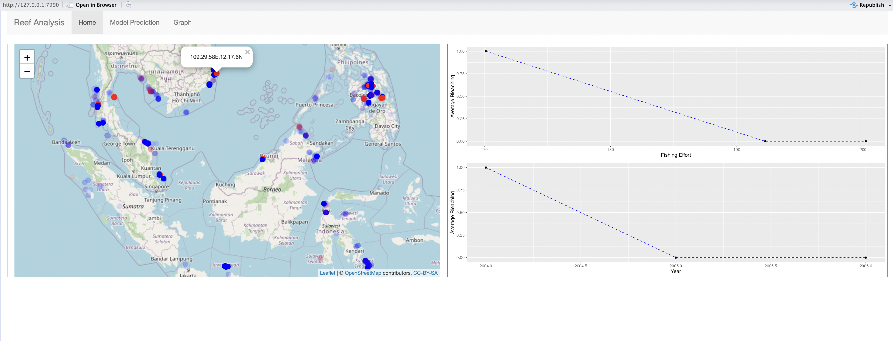

More figures shown in Appendix 6


**Large Language Model**
In order to ensure that technical knowledge wouldn’t be the factor prohibiting Indonesian marine science researchers from effectively interacting and interpreting our model and results, we developed a Large Language Model. 

We finetuned the model off our results, our report, as well as the latest scientific papers. This way the Indonesian government can ask quick questions and get relevant responses without having to read a large number of pages. 

Here is a sample conversation. 

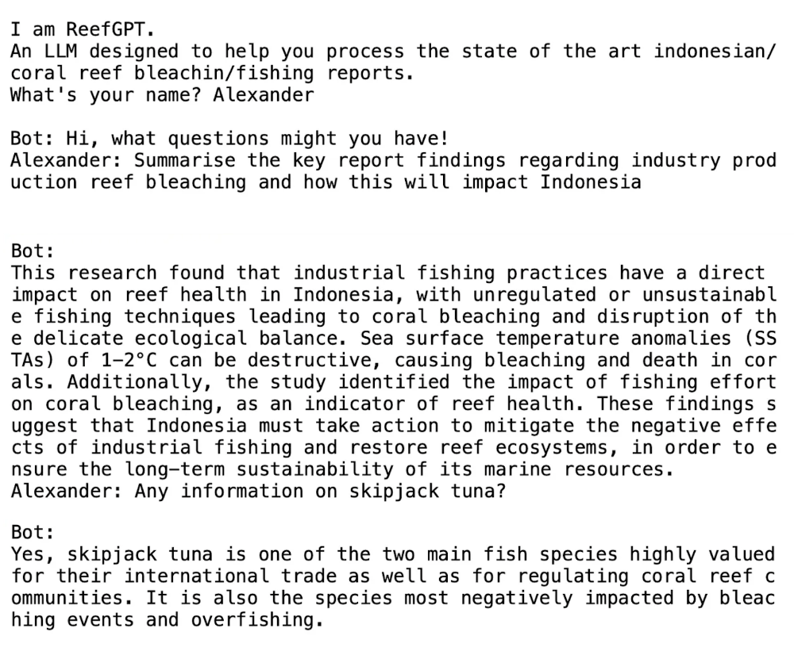

More information regarding implementation as well as a deeper explanation will be provided in the appendix.

## Discussion

Our research investigates the relationship between SSTA and the occurrence of coral bleaching in Indonesia. The results demonstrate a significant positive correlation between SSTA and the incidence of coral bleaching in this region. These findings align with previous research that has highlighted the sensitivity of coral reefs to elevated water temperatures (Brown, 1997, Gusviga et al., 2021, Hoegh-Guldberg, 1999). 

As explored in the results, fishing effort in Indonesia has escalated despite the anthropogenic pressures placed on the reefs. This increase can be attributed to the growing demand for fish stocks and the increased involvement of the Indonesian government in the fishing sector. Notably, there has been a recent change in the Indonesian fisheries policies on March 6, 2023, re-establishing foreign investment in the country’s marine capture sector (Gokkon, 2023). Upon the ban lift, destructive practices such as cyanide fishing and excessive fishing production are expected to resurface (Gokkon, 2023; Pet-Soede & Erdmann, 1998). It is highly recommended that the Indonesian government reinstate the ban and enforce strict catch limits to facilitate the recovery of fish stocks and replenish them to sustainable levels. 、

Over the past few decades cyanide fishing has become prevalent across Indonesia as a method to stun and capture fish within reef systems (Williams et al., 2018). Studies (Cervino et al., 2003) have revealed that corals exposed to cyanide cause the expulsion of zooxanthellae causing the reef to bleach. This is an imprecise variable which provides suggestive approximation of the vulnerability of reefs based on increased fishing effort within Indonesia (Napitupulu et al., 2022). Therefore, we may acknowledge that our model uses an industrial fishing data set as a proxy for the nature of cyanide fishing which negatively impacts coral reef health. 


## Limitations

While our study had an effective approach and covered many necessary facets, there are some limitations that need to be mentioned as well as places with room for future improvement.

For example, our study focused on the impact of SSTA on coral bleaching, it is important to recognise that other factors such as water quality, pollution, and localized stressors, can also influence the susceptibility of corals to bleaching (Novi & Bracco, 2022). Additionally, it is worth highlighting the accompanying issues regarding the use of cyanide fishing data as it largely remains an illegal and unmonitored practice across Indonesia (Maderia, et al., 2020). 

Technically, there are a number of accompanying limitations and shortcomings as well. During the qualitative and usability evaluation surveys, we had to use marine science students as a proxy for the Indonesian marine researchers. However, it is crucial to recognise fundamental cultural, social, and background disparities between the two groups which can potentially impact the quality of the results.

Future technical extensions could include the ability for the Application and the LLM to offer Bahasa Indonesian as a language option. This would likely have a big improvement in regards to interpretability from the intended audience. To ensure future extensibility, enabling the ability to upload new datasets to update the model could ensure the system remains valuable long into the future.	


## Conclusion

To conclude, the investigation reveals that there is a direct correlation between SSTA, fishing effort and bleaching rates. It indicates that as both SSTA and fishing effort increase, the overall reef health declines. Additionally, it is evident that the proximity of industrial fishing to a reef directly correlates with a higher indication of coral bleaching. This places vital fish species such as skipjack tuna and blue mackerel at risk of overexploitation, further disrupting the reef’s ecological balance. 

## Student Contributions

Alexander Marrapese: I worked on a variety of things from building and implementing the LLM to conducting the qualitative and usability evaluations. I also helped guide the overall flow of the project and helped delegate tasks.

Frank Shi: I worked on different models including knn/nn/svm/rf/lm to help to generate a prediction result. I built the shiny app to visualize the result. I help with model evaluation to check the model accuracy.

Saanvi Deobhankar: I helped with developing the research question from a marine science perspective and undertaking literature research on fishing effort and the role Indonesian government plays in the fishing industry. I also helped overall editing the report. 

Yilin Chen: I cleaned and merged data for three_selected_fish.csv, this dataset is used for graphs in the shiny app. I also built and tidied the group GitHub repository, checked and arranged code to different rmd files. 

Aaron Hua: I developed the quantitative evaluation strategies and implemented these evaluation strategies to the machine learning models. I also assisted in formulating the results, outlined the shiny app and created the conclusion in the report.

Geordie McColl: ​​I contributed to the significance and relevance of industrial fishing to coral bleaching with context to cyanide fishing. I also helped with the written aspect of the report and contributed to providing a marine science perspective throughout the report. 

Juliette Gard: I contributed to the literature review in context to providing overall background information for our project with technical marine science knowledge. I also helped write the discussion with the focus of SSTa influence on coral bleaching. 

Rubaina Tausif: I created figures 1 and 2 that outline the research workflow and model workflow. I also assisted in the outlining the interpretation of the results and assisted in outlining the outcome of the evaluations.


## References

Alvarez-Filip, L., Dulvy, N. K., Gill, J. A., Côté, I. M., & Watkinson, A. R. (2009). Flattening of Caribbean coral reefs: region-wide declines in architectural complexity. Proceedings of the Royal Society B: Biological Sciences, 276(1669), 3019–3025. https://doi.org/10.1098/rspb.2009.0339

‌Brown, B. E. (1997). Coral bleaching: causes and consequences. Coral Reefs, 16(0), S129–S138. https://doi.org/10.1007/s003380050249

Cervino, J. M., Hayes, R. L., Honovich, M., Goreau, T. J., Jones, S., & Rubec, P. J. (2003). Changes in zooxanthellae density, morphology, and mitotic index in hermatypic corals and anemones exposed to cyanide. Mar Pollut Bull, 46(5), 573-586. doi:10.1016/S0025-326X(03)00071-7

Gokkon, B. (2023) Rule change sees foreign investors back in Indonesia’s fisheries scene, Mongabay Environmental News. Available at: https://news.mongabay.com/2023/03/indonesia-fisheries-management-policy-foreign-investment-marine-sustainable/ (Accessed: 24 May 2023).

Gusviga, B. H., Subiyanto, Faizal, I., Yusri, S., Sari, S. K., & Purba, N. P. (2021). Occurrence and Prediction of Coral Bleaching Based on Ocean Surface Temperature Anomalies and Global Warming in Indonesian Waters. IOP Conference Series: Earth and Environmental Science, 750(1), 012032. https://doi.org/10.1088/1755-1315/750/1/012032

Halim, D. and Juanri, J. (2016) Indonesia’s aquaculture industry: Key Sectors for future growth, IPSOS. Available at: https://www.ipsos.com/en/indonesias-aquaculture-industry-key-sectors-future-growth (Accessed: 24 May 2023).

Madeira, D., Andrade, J., Leal, M. C., Ferreira, V., Rocha, R. J. M., Rosa, R., & Calado, R. (2020). Synergistic Effects of Ocean Warming and Cyanide Poisoning in an Ornamental Tropical Reef Fish. Frontiers in Marine Science, 7. doi:10.3389/fmars.2020.00246

MMAF (Indonesian Ministry of Marine Affairs and Fisheries and World Wide Fund for Nature), (2011). Action Plan Indonesian Tuna Fisheries., Indonesian Ministry of Marine Affairs and Fisheries & WWF, Indonesia, pp. 1-54. https://www.iccia.com/sites/default/files/policieslegislation/ins176205.pdf (Accessed: 24 May 2023)

Napitupulu, L., Tanaya Sitanggang, S., Ayostina, I., Andesta, I., Fitriana, R., Ayunda, D., . . . Haryanto, R. (2022). Trends in Marine Resources and Fisheries Management in Indonesia: A Review. World Resources Institute. doi:10.46830/wrirpt.20.00064

Pandolfi, J. M., Connolly, S. R., Marshall, D. J., & Cohen, A. L. (2011). Projecting Coral Reef Futures Under Global Warming and Ocean Acidification. Science, 333(6041), 418–422. https://doi.org/10.1126/science.1204794

Pet-Soede, L. and Erdmann, M., 1998. An overview and comparison of destructive fishing practices in Indonesia.

Powderham, A. J., & van der Meij, S. (2020). At the Heart of the Coral Triangle Celebrating Biodiversity. Taylor & Francis Group.

Williams, SL, Sur, C, Janetski, N, Hollarsmith, JA, Rapi, S, Barron, L, Heatwole, SJ, Yusuf, AM, Yusuf, S, Jompa, J, & Mars, F, 2019,, ‘Large‐scale coral reef rehabilitation after blast fishing in Indonesia’, Restoration Ecology, vol. 27, no. 2, pp. 447–456, doi: 10.1111/rec.12866.


## Appendix

### Appendix 1 - EDA

Explain each of the graphs with what it does and what we learnt from it. 

Investigating bleaching vs not bleaching. 

```{r EDA}
merged_effort <- read.csv("merged.csv")

merged_effort %>% 
ggplot(aes(x = average_bleaching, y = rate_norm)) +
  geom_point()

merged_effort %>% 
  mutate(bleached = ifelse(average_bleaching > 0, "Bleached", "Not bleached")) %>% 
  ggplot(aes(x = bleached, y = log(rate_norm))) +
  geom_boxplot()
```

### Appendix 2 - Assumption Checking

By assuption check, we found that the data were not well distributed normally, and for this reason we believe that the linear regression model is not reasonable to apply here.

```{r}
hist(merged_effort$distance_to_nearest_reef, main = "Histogram for Distance to Nearest Reef", xlab = "Distance")

# Histogram for rate_norm
hist(merged_effort$rate_norm, main = "Histogram for Rate Norm", xlab = "Rate")

# Histogram for clim_sst
hist(merged_effort$clim_sst, main = "Histogram for Clim SST", xlab = "Clim")
```
```{r}
# QQ Plot for distance_to_nearest_reef
qqnorm(merged_effort$distance_to_nearest_reef); qqline(merged_effort$distance_to_nearest_reef)

# QQ Plot for rate_norm
qqnorm(merged_effort$rate_norm); qqline(merged_effort$rate_norm)

# QQ Plot for clim_sst
qqnorm(merged_effort$clim_sst); qqline(merged_effort$clim_sst)
```


### Appendix 3 - Quantitative Results

Learning curve for All models
```{r}
# Initialize a data frame to store the results
results <- data.frame(Model = character(), Resample = numeric(), Accuracy = numeric(), Set = character())

# Perform the cross-validation manually
folds <- createFolds(training_set$bleaching_occurred, k = 10)
for (i in 1:10) {
    # Create the training and validation sets for this fold
    train_indices <- folds[[i]]
    train_fold <- training_set[train_indices, ]
    valid_fold <- training_set[-train_indices, ]
    
    # Train the model on the training fold
    rf_model <- randomForest(bleaching_occurred ~ clim_sst + rate_norm + distance_to_nearest_reef, data = train_fold)
    
    # Evaluate the model on the training and validation folds
    train_predictions <- predict(rf_model, newdata = train_fold)
    valid_predictions <- predict(rf_model, newdata = valid_fold)
    
    # Calculate the accuracy
    train_accuracy <- sum(train_predictions == train_fold$bleaching_occurred) / nrow(train_fold)
    valid_accuracy <- sum(valid_predictions == valid_fold$bleaching_occurred) / nrow(valid_fold)
    
    # Add the results to the data frame
    results <- rbind(results, 
                     data.frame(Model = "Random Forest", Resample = i, Accuracy = train_accuracy, Set = "Training"),
                     data.frame(Model = "Random Forest", Resample = i, Accuracy = valid_accuracy, Set = "Validation"))
}

ggplot(results, aes(x = Resample, y = Accuracy, color = Set)) +
  geom_line() +
  facet_wrap(~ Model) +
  labs(title = "Learning Curve", x = "Resample", y = "Accuracy") +
  scale_color_discrete(name = "Set") +
  theme_minimal()
```

```{r}
# Initialize a data frame to store the results
results <- data.frame(Model = character(), Resample = numeric(), Accuracy = numeric(), Set = character())

# Perform the cross-validation manually
folds <- createFolds(training_set$bleaching_occurred, k = 10)
for (i in 1:10) {
    # Create the training and validation sets for this fold
    train_indices <- folds[[i]]
    train_fold <- training_set[train_indices, ]
    valid_fold <- training_set[-train_indices, ]
    
    # Train the model on the training fold
    svm_model <- svm(bleaching_occurred ~ clim_sst + rate_norm + distance_to_nearest_reef, data = train_fold)
    
    # Evaluate the model on the training and validation folds
    train_predictions <- predict(svm_model, newdata = train_fold)
    valid_predictions <- predict(svm_model, newdata = valid_fold)
    
    # Calculate the accuracy
    train_accuracy <- sum(train_predictions == train_fold$bleaching_occurred) / nrow(train_fold)
    valid_accuracy <- sum(valid_predictions == valid_fold$bleaching_occurred) / nrow(valid_fold)
    
    # Add the results to the data frame
    results <- rbind(results, 
                     data.frame(Model = "SVM", Resample = i, Accuracy = train_accuracy, Set = "Training"),
                     data.frame(Model = "SVM", Resample = i, Accuracy = valid_accuracy, Set = "Validation"))
}

ggplot(results, aes(x = Resample, y = Accuracy, color = Set)) +
  geom_line() +
  facet_wrap(~ Model) +
  labs(title = "Learning Curve", x = "Resample", y = "Accuracy") +
  scale_color_discrete(name = "Set") +
  theme_minimal()
```

```{r}
# Initialize a data frame to store the results
results <- data.frame(Model = character(), Resample = numeric(), Accuracy = numeric(), Set = character())

# Perform the cross-validation manually
folds <- createFolds(training_set$bleaching_occurred, k = 10)
for (i in 1:10) {
    # Create the training and validation sets for this fold
    train_indices <- folds[[i]]
    train_fold <- training_set[train_indices, ]
    valid_fold <- training_set[-train_indices, ]
    
    # Train the model on the training fold
    knn_model <- knn3(bleaching_occurred ~ clim_sst + rate_norm + distance_to_nearest_reef, data = train_fold)
    
    # Evaluate the model on the training and validation folds
    train_predictions <- predict(knn_model, newdata = train_fold)
    valid_predictions <- predict(knn_model, newdata = valid_fold)
    
    # Calculate the accuracy
    train_accuracy <- sum(train_predictions == train_fold$bleaching_occurred) / nrow(train_fold)
    valid_accuracy <- sum(valid_predictions == valid_fold$bleaching_occurred) / nrow(valid_fold)
    
    # Add the results to the data frame
    results <- rbind(results, 
                     data.frame(Model = "KNN", Resample = i, Accuracy = train_accuracy, Set = "Training"),
                     data.frame(Model = "KNN", Resample = i, Accuracy = valid_accuracy, Set = "Validation"))
}

# Now, you can plot the learning curve
ggplot(results, aes(x = Resample, y = Accuracy, color = Set)) +
  geom_line() +
  facet_wrap(~ Model) +
  labs(title = "Learning Curve", x = "Resample", y = "Accuracy") +
  scale_color_discrete(name = "Set") +
  theme_minimal()
```
```{r}
# Initialize a data frame to store the results
results <- data.frame(Model = character(), Resample = numeric(), Accuracy = numeric(), Set = character())

# Perform the cross-validation manually
folds <- createFolds(training_set$bleaching_occurred, k = 10)
for (i in 1:10) {
    # Create the training and validation sets for this fold
    train_indices <- folds[[i]]
    train_fold <- training_set[train_indices, ]
    valid_fold <- training_set[-train_indices, ]
    
    # Train the model on the training fold
    nn_model_fit <- nnet(bleaching_occurred ~ clim_sst + rate_norm + distance_to_nearest_reef, data = training_set, linout = FALSE, trace = FALSE, size = 3)
    
    # Evaluate the model on the training and validation folds
    train_predictions <- predict(nn_model_fit, newdata = train_fold)
    valid_predictions <- predict(nn_model_fit, newdata = valid_fold)
    
    # Calculate the accuracy
    train_accuracy <- sum(train_predictions == train_fold$bleaching_occurred) / nrow(train_fold)
    valid_accuracy <- sum(valid_predictions == valid_fold$bleaching_occurred) / nrow(valid_fold)
    
    # Add the results to the data frame
    results <- rbind(results, 
                     data.frame(Model = "NN", Resample = i, Accuracy = train_accuracy, Set = "Training"),
                     data.frame(Model = "NN", Resample = i, Accuracy = valid_accuracy, Set = "Validation"))
}

# Now, you can plot the learning curve
ggplot(results, aes(x = Resample, y = Accuracy, color = Set)) +
  geom_line() +
  facet_wrap(~ Model) +
  labs(title = "Learning Curve", x = "Resample", y = "Accuracy") +
  scale_color_discrete(name = "Set") +
  theme_minimal()
```

Feature Importance for RandomForest
```{r}
##RF
library(randomForest)
library(iml)

split_indices <- createDataPartition(merged_effort$average_bleaching, p = 0.8, list = FALSE)
  training_set <- merged_effort[split_indices, ]
  testing_set <- merged_effort[-split_indices, ]
  training_set$bleaching_occurred <- as.factor(ifelse(training_set$average_bleaching > 0, 1, 0))
  testing_set$bleaching_occurred <- as.factor(ifelse(testing_set$average_bleaching > 0, 1, 0))
  rf_model <- randomForest(bleaching_occurred ~ clim_sst + rate_norm + distance_to_nearest_reef,
                           data = training_set)
  rf_predictor <- Predictor$new(rf_model, data = testing_set[, c("clim_sst", "rate_norm", "distance_to_nearest_reef")], y = as.numeric(testing_set$bleaching_occurred), type = "prob")
  rf_importance <- iml::FeatureImp$new(rf_predictor, loss = "ce")
  plot(rf_importance)
```

Feature Importance for SVM
```{r}
##SVM
split_indices <- createDataPartition(merged_effort$average_bleaching, p = 0.8, list = FALSE)
  training_set <- merged_effort[split_indices, ]
  testing_set <- merged_effort[-split_indices, ]
  training_set$bleaching_occurred <- as.factor(ifelse(training_set$average_bleaching > 0, 1, 0))
  testing_set$bleaching_occurred <- as.factor(ifelse(testing_set$average_bleaching > 0, 1, 0))
  rf_model <- svm(bleaching_occurred ~ clim_sst + rate_norm + distance_to_nearest_reef,
                           data = training_set)
  rf_predictor <- Predictor$new(rf_model, data = testing_set[, c("clim_sst", "rate_norm", "distance_to_nearest_reef")], y = as.numeric(testing_set$bleaching_occurred), type = "prob")
  rf_importance <- iml::FeatureImp$new(rf_predictor, loss = "ce")
  plot(rf_importance)
```
Feature Importance for KNN
```{r}
##knn
split_indices <- createDataPartition(merged_effort$average_bleaching, p = 0.8, list = FALSE)
  training_set <- merged_effort[split_indices, ]
  testing_set <- merged_effort[-split_indices, ]
  training_set$bleaching_occurred <- as.factor(ifelse(training_set$average_bleaching > 0, 1, 0))
  testing_set$bleaching_occurred <- as.factor(ifelse(testing_set$average_bleaching > 0, 1, 0))
  rf_model <- knn3(bleaching_occurred ~ clim_sst + rate_norm + distance_to_nearest_reef,
                           data = training_set)
  rf_predictor <- Predictor$new(rf_model, data = testing_set[, c("clim_sst", "rate_norm", "distance_to_nearest_reef")], y = as.numeric(testing_set$bleaching_occurred), type = "prob")
  rf_importance <- iml::FeatureImp$new(rf_predictor, loss = "ce")
  plot(rf_importance)
```


### Appendix 4 - Qualitative and Usability Results
Here include images from survey results

Qualitative Evaluation

Seeing as this is incredibly subjective, we ensured we had open ended questions for marine science students to explain their perceptions. 

Questions:

- What is your initial reaction to the model?
- What are some perceived strengths of the model?
- What are some perceived weaknesses of the model?
- Any features you recommend we try to include?
- Any features you suggest we try to remove?


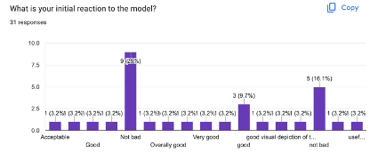

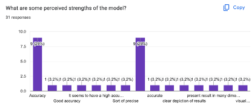

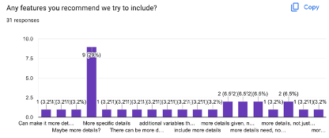

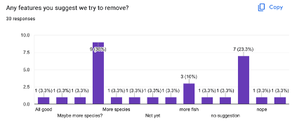

Usability Evaluation

We believed that survey respondents would be able to respond with a numerical response to this so we tailored the questions to that.

Questions:

- Rank the learnability from 1 to 5
- Rank the ease of use from 1 to 5
- Rank how intuitive the layout of the product was from 1 to 5
- Rank the speed of the model from 1 to 5
- Rank how user friendly the system was from 1 to 5

Here are the responses. (Seeing as this can’t be done in a reproducible fashion in R, we have added in screenshots)

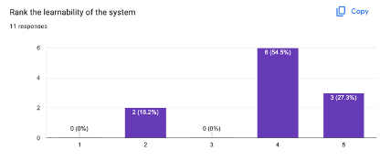

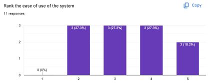

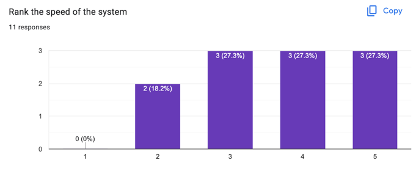

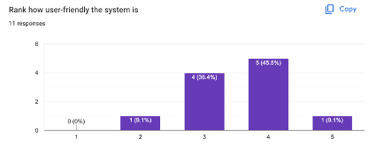

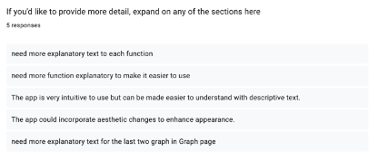

Appendix 5 - Large Language Model
Include image from the presentation, as well as a proper explanation of how it works and difficulties with code sharing.

Appendix 6 - Shiny App
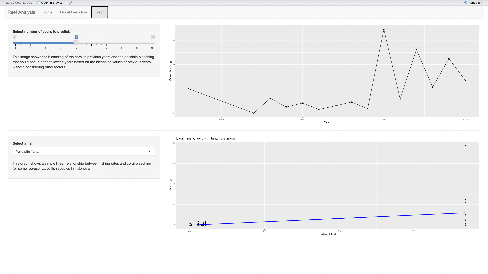
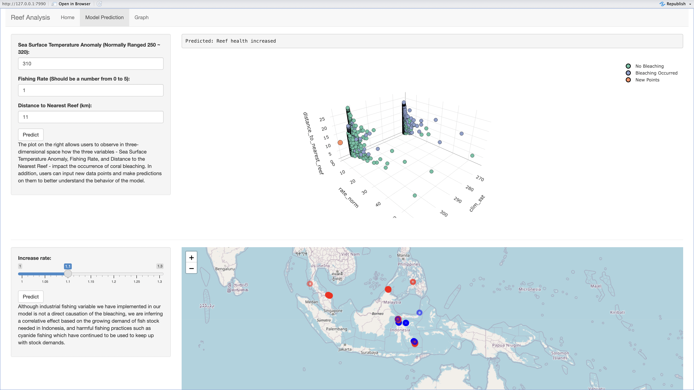
The reef analysis shiny app is divided into three main sections. The Home page, Model prediction page and Graph page. The home page will first allow users to see a world map however the main focus will be over the Indonesian region. The interactive map includes red and blue plot points that indicate the presence of coral. The red points represent coral points that have an occurrence of bleaching, while the blue points represent coral points that do not have an occurrence of bleaching. When a user selects a point, two graphs will appear on the right hand side. One will visually present the relationship between average bleaching and fishing effort, while the other displays a time series of average bleaching across a period of time. The data points also show the degree of data available at that point by adjusting the transparency. The greater the transparency, the less information is known about that reef.

The model prediction page consists of two main broad categories, one in which the user is able to actively input custom values for sea surface temperature anomaly, fishing rate, and distance to nearest reef. From these values a new point will be plotted into an interactive 3-dimensional graph that includes the points found from the collected data. The new point will be orange, the green points will indicate bleaching, and the lilac point will indicate bleaching occurrence. The second is the overall fishing rate change, in which the user can adjust the overall fishing catch rate to see how coral bleaching occurs across Indonesia with these changes.

The graph page also consists of two additional graphs. The first depicts the relationship between the average bleaching across multiple years. The user is able to further choose the number of years they would like to see as bleaching continues. The graphs will then reveal a predicted possibility of bleaching in the time chosen. The second graph will present the relationship between the fishing effort expended on specific fish species and coral bleaching. The graph shown will be based on the user's choice of species. 


